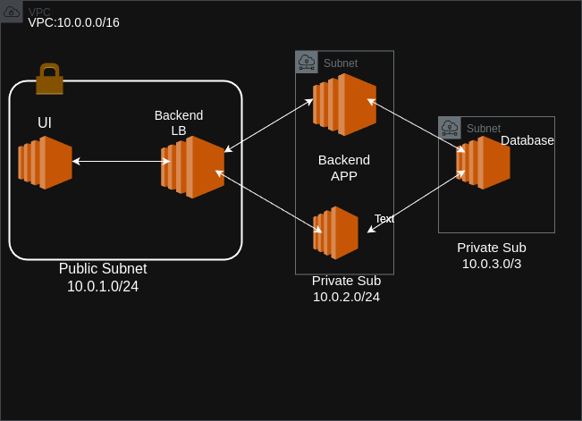

# fullstack-todo-app

This repository contains a full-stack Todo application built with a NestJS backend and a React frontend with DevOps functionality. The application allows users to manage their tasks efficiently with features such as user authentication, task creation, updating, and deletion. The backend is powered by NestJS, providing a robust and scalable API, while the frontend is built with React, offering a dynamic and responsive user interface.

## Architecture



This section provides an overview of the architecture of the fullstack-todo-app, illustrating how the backend, database, and frontend components interact with each other.

- **Frontend**: Built with React, it provides a user-friendly interface for managing todos. It communicates with the backend via RESTful APIs.
- **Backend**: Developed using NestJS, it handles business logic, data processing, and API endpoints. It uses TypeORM for database interactions.
- **Database**: A PostgreSQL database is used to store user and todo data.
- **DevOps**: Docker is used for containerization, and Pulumi is used for infrastructure as code to manage AWS resources.

## Docker Commands

### Backend

- **Build the Docker image**:
  ```bash
  make -C backend build
  ```
  Builds the Docker image for the backend service.

- **Run the Docker container**:
  ```bash
  make -C backend run
  ```
  Runs the backend service in a Docker container, exposing port 8080.

- **Stop the Docker container**:
  ```bash
  make -C backend stop
  ```
  Stops the running backend container.

- **Clean up the Docker container**:
  ```bash
  make -C backend clean
  ```
  Stops and removes the backend container.

- **View logs**:
  ```bash
  make -C backend logs
  ```
  Follows the logs of the backend container.

- **Push the Docker image to a registry**:
  ```bash
  make -C backend push
  ```
  Tags and pushes the backend image to the specified registry.

- **Pull the Docker image from a registry**:
  ```bash
  make -C backend pull
  ```
  Pulls the backend image from the specified registry.

### Database

- **Build the Docker image**:
  ```bash
  make -C db build
  ```
  Builds the Docker image for the database service.

- **Run the Docker container**:
  ```bash
  make -C db run
  ```
  Runs the database service in a Docker container, exposing port 5432.

- **Stop the Docker container**:
  ```bash
  make -C db stop
  ```
  Stops the running database container.

- **Clean up the Docker container and image**:
  ```bash
  make -C db clean
  ```
  Stops, removes the database container, and removes the image.

- **Push the Docker image to a registry**:
  ```bash
  make -C db push
  ```
  Tags and pushes the database image to the specified registry.

- **Pull the Docker image from a registry**:
  ```bash
  make -C db pull
  ```
  Pulls the database image from the specified registry.

### Frontend

- **Build the Docker image**:
  ```bash
  make -C frontend build
  ```
  Builds the Docker image for the frontend service.

- **Run the Docker container**:
  ```bash
  make -C frontend run
  ```
  Runs the frontend service in a Docker container, exposing port 80.

- **Stop and remove the Docker container**:
  ```bash
  make -C frontend stop
  ```
  Stops and removes the frontend container.

- **Clean up the Docker container and image**:
  ```bash
  make -C frontend clean
  ```
  Stops, removes the frontend container, and removes the image.

- **Push the Docker image to a registry**:
  ```bash
  make -C frontend push
  ```
  Tags and pushes the frontend image to the specified registry.

- **Pull the Docker image from a registry**:
  ```bash
  make -C frontend pull
  ```
  Pulls the frontend image from the specified registry.

- **Restart the Docker container**:
  ```bash
  make -C frontend restart
  ```
  Stops, removes, and runs the frontend container again.

Ensure that you have Docker installed and running, and that you are in the root directory of your project when executing these commands. Adjust the registry and image names as necessary for your setup.
